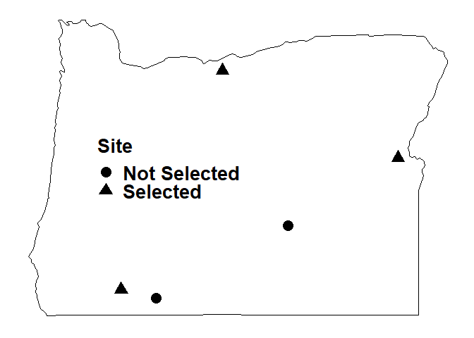
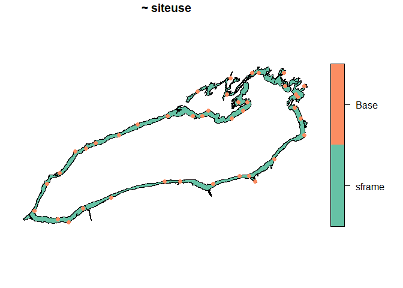

# Preliminaries {.unnumbered}

This document contains the replication script for "spsurvey: spatial sampling design and analysis in R" for consideration of publication in the Journal of Statistical Software (JSS). As per the JSS author guidelines, the replication script contains exact code used to reproduce the manuscript. You must install the development version of spsurvey considered in this submission by installing the tarball provided alongside the submission or by running


```r
## install.packages("remotes") # if needed
## remotes::install_github("USEPA/spsurvey", ref = "develop")
```


Data and scripts used to create the manuscript itself are available in a supplementary R package that can be downloaded by installing the tarball provided alongside the submission or by running


```r
## remotes::install_github("USEPA/spsurvey.manuscript", ref = "main", dependencies = TRUE)
```

The supplementary R package must be installed before proceeding with the Section 4 (Application) of the replication script. Instructions for using and finding files in the supplementary R package are available in the `README` of the package's GitHub repository: [https://github.com/USEPA/spsurvey.manuscript](https://github.com/USEPA/spsurvey.manuscript). It is recommended read the `README` before proceeding with this file, as the `README` contains some useful contextual information. Note that some of the images used in the manuscript underwent minor adjustments to code presented here in order to use high-quality, publication-ready figures in the manuscript. The code used to generate these higher-quality images is available after downloading the supplementary package. The code used to generate lower-quality images is provided in this document.

This document can be viewed without requiring you save and knit it by visiting a pre-knitted Markdown file located in the supplementary package's GitHub repository at [https://github.com/USEPA/spsurvey.manuscript/blob/main/inst/scripts/replication/code.md](https://github.com/USEPA/spsurvey.manuscript/blob/main/inst/scripts/replication/code.md). This is helpful in the event that some version discrepancy prevents you from compiling the document.

Before proceeding, load spsurvey and the packages installed alongside the spsurvey.manuscript package.


```r
library("spsurvey")
library("cowplot")
library("dplyr")
library("spsurvey.manuscript")
library("ggplot2")
library("knitr")
library("maps")
library("rmarkdown")
library("xtable")
library("parallel")
```


We will also load a reproducible seed (chosen as 5 because the original submission coincided version 5.0 of spsurvey) by running


```r
set.seed(5)
```


A raw replication script (with a `.R` extension) was also uploaded in the submission alongside the R Markdown replication script (with a `.Rmd` extension) to provide an easier way to run code interactively. This R script was generated using `knitr::purl(, documentation = 2)`. Next we provide code used to build the manuscript section-by-section.

# Introduction

There was no code in this section (outside of installing and loading spsurvey).

# Spatially balanced sampling

## Summarizing and visualizing sampling frames

To load the `NE_Lakes` data from spsurvey into the global environment, run


```r
data("NE_Lakes")
```


To make `NE_Lakes` an `sp_frame` object, run


```r
NE_Lakes <- sp_frame(NE_Lakes)
```


To summarize lakes by elevation category, run


```r
summary(NE_Lakes, formula = ~ ELEV_CAT)
```

```
#>    total     ELEV_CAT  
#>  total:195   low :112  
#>              high: 83
```


To visualize lakes by elevation category, run


```r
plot(NE_Lakes, formula = ~ ELEV_CAT, key.width = lcm(3))
```

<!-- -->


The `key.width` argument was not included in the code in the manuscript but may be needed to properly display categorical figure legends.

To summarize lakes by elevation category and the interaction between elevation category and area category, run


```r
summary(NE_Lakes, formula = ~ ELEV_CAT + ELEV_CAT:AREA_CAT)
```

```
#>    total     ELEV_CAT    ELEV_CAT:AREA_CAT
#>  total:195   low :112   low:small :82     
#>              high: 83   high:small:53     
#>                         low:large :30     
#>                         high:large:30
```


To visualize lakes by elevation category and the interaction between elevation category and area category (figure 1 in the manuscript), run


```r
# figure 1
plot(NE_Lakes, formula = ~ ELEV_CAT + ELEV_CAT:AREA_CAT, key.width = lcm(3))
```

<!-- --><!-- -->


To summarize lake elevation by area category, run


```r
summary(NE_Lakes, formula = ELEV ~ AREA_CAT)
```

```
#> ELEV by total: 
#>       Min. 1st Qu. Median     Mean 3rd Qu.   Max.
#> total    0  21.925  69.09 127.3862 203.255 561.41
#> 
#> ELEV by AREA_CAT: 
#>       Min. 1st Qu.  Median     Mean  3rd Qu.   Max.
#> small 0.00   19.64  59.660 117.4473 176.1700 561.41
#> large 0.01   26.75 102.415 149.7487 241.2025 537.84
```


To visualize lake elevation by area category, run


```r
# output not shown in manuscript
plot(NE_Lakes, formula = ELEV ~ AREA_CAT)
```

<!-- --><!-- -->


## The Generalized Random Tessellation Stratified (GRTS) algorithm

For a visual representation of the GRTS algorithm (figure 2 in the manuscript), run


```r
# figure 2


## set some graphical parameters
ht <-  4
wid <- 4 / 3 * ht

## grid preliminaries
us_states <- map_data("state")
oregon_data <- subset(us_states, region == "oregon")
n_pop <- 5
n_samp <- 3
pop_long <- c(-122.75, -120.80, -117.42, -119.54, -122.08)
pop_lat <- c(42.37, 45.50, 44.25, 43.29, 42.25)
population_data <- data.frame(lat = pop_lat, long = pop_long)
min_long <- min(oregon_data$long)
max_long <- max(oregon_data$long)
min_lat <- min(oregon_data$lat)
max_lat <- max(oregon_data$lat)
scaled_oregon_data <- data.frame(lat = (oregon_data$lat - min_lat) / (max_lat - min_lat), long = (oregon_data$long - min_long) / (max_long - min_long))
scaled_population_data <- data.frame(lat = (population_data$lat - min_lat) / (max_lat - min_lat), long = (population_data$long - min_long) / (max_long - min_long))
low <- 0
q1 <- 0.25
mid <- 0.5
q3 <- 0.75
high <- 1
q18 <- 1 / 8
q38 <- 3 / 8
q58 <- 5 / 8
q78 <- 7 / 8

# figure 2a     ----------------------------------------------------------------
annotate_size <- 30
grts_level1 <- ggplot() +
  geom_path(scaled_oregon_data, mapping = aes(x = long, y = lat), col = "black") +
  geom_point(data = scaled_population_data, mapping = aes(x = long, y = lat), size = 5) +
  geom_segment(aes(x = low, xend = high, y = low, yend = low), linetype = "dashed", col = "black") +
  geom_segment(aes(x = low, xend = high, y = mid, yend = mid), linetype = "dashed", col = "black") +
  geom_segment(aes(x = low, xend = high, y = high, yend = high), linetype = "dashed", col = "black") +
  geom_segment(aes(x = low, xend = low, y = low, yend = high), linetype = "dashed", col = "black") +
  geom_segment(aes(x = mid, xend = mid, y = low, yend = high), linetype = "dashed", col = "black") +
  geom_segment(aes(x = high, xend = high, y = low, yend = high), linetype = "dashed", col = "black") +
  annotate(geom = "text", x = q1, y = q1, label = "2", size = annotate_size, col = "black") +
  annotate(geom = "text", x = q1, y = q3, label = "1", size = annotate_size, col = "black") +
  annotate(geom = "text", x = q3, y = q3, label = "3", size = annotate_size, col = "black") +
  annotate(geom = "text", x = q3, y = q1, label = "0", size = annotate_size, col = "black") +
  theme(axis.text = element_blank(),
        axis.title = element_blank(),
        axis.ticks = element_blank(),
        panel.grid = element_blank(),
        panel.background = element_blank())

grts_level1

## figure 2b     ----------------------------------------------------------------
annotate_size <- 15
grts_level2 <- ggplot() +
  geom_path(scaled_oregon_data, mapping = aes(x = long, y = lat), col = "black") +
  geom_point(data = scaled_population_data, mapping = aes(x = long, y = lat), size = 5) +
  geom_segment(aes(x = low, xend = high, y = low, yend = low), linetype = "dashed", col = "black") +
  geom_segment(aes(x = low, xend = high, y = mid, yend = mid), linetype = "dashed", col = "black") +
  geom_segment(aes(x = low, xend = high, y = high, yend = high), linetype = "dashed", col = "black") +
  geom_segment(aes(x = low, xend = low, y = low, yend = high), linetype = "dashed", col = "black") +
  geom_segment(aes(x = mid, xend = mid, y = low, yend = high), linetype = "dashed", col = "black") +
  geom_segment(aes(x = high, xend = high, y = low, yend = high), linetype = "dashed", col = "black") +
  geom_segment(aes(x = q1, xend = q1, y = low, yend = high), linetype = "dashed", col = "black") +
  geom_segment(aes(x = q3, xend = q3, y = low, yend = high), linetype = "dashed", col = "black") +
  geom_segment(aes(x = low, xend = high, y = q1, yend = q1), linetype = "dashed", col = "black") +
  geom_segment(aes(x = low, xend = high, y = q3, yend = q3), linetype = "dashed", col = "black") +
  # low left
  annotate(geom = "text", x = q18, y = q18, label = "21", size = annotate_size, col = "black") +
  annotate(geom = "text", x = q18, y = q38, label = "22", size = annotate_size, col = "black") +
  annotate(geom = "text", x = q38, y = q18, label = "20", size = annotate_size, col = "black") +
  annotate(geom = "text", x = q38, y = q38, label = "23", size = annotate_size, col = "black") +
  # top left
  annotate(geom = "text", x = q18, y = q58, label = "13", size = annotate_size, col = "black") +
  annotate(geom = "text", x = q18, y = q78, label = "11", size = annotate_size, col = "black") +
  annotate(geom = "text", x = q38, y = q58, label = "12", size = annotate_size, col = "black") +
  annotate(geom = "text", x = q38, y = q78, label = "10", size = annotate_size, col = "black") +
  # top right
  annotate(geom = "text", x = q58, y = q18, label = "01", size = annotate_size, col = "black") +
  annotate(geom = "text", x = q58, y = q38, label = "02", size = annotate_size, col = "black") +
  annotate(geom = "text", x = q78, y = q18, label = "03", size = annotate_size, col = "black") +
  annotate(geom = "text", x = q78, y = q38, label = "00", size = annotate_size, col = "black") +
  # low right
  annotate(geom = "text", x = q58, y = q58, label = "32", size = annotate_size, col = "black") +
  annotate(geom = "text", x = q58, y = q78, label = "31", size = annotate_size, col = "black") +
  annotate(geom = "text", x = q78, y = q58, label = "33", size = annotate_size, col = "black") +
  annotate(geom = "text", x = q78, y = q78, label = "30", size = annotate_size, col = "black") +
  theme(axis.text = element_blank(),
        axis.title = element_blank(),
        axis.ticks = element_blank(),
        panel.grid = element_blank(),
        panel.background = element_blank())


grts_level2

# figure 2c --------------------------------------------------------------------
x <- seq(0, n_samp, length.out = 100)
yht <- 0.4
ysep <- 0.1
yeps <- 0.05
line_data <- data.frame(x = x, y = yht)
xprobs <- 3 / 5 * 1:5
point_data <- data.frame(
  x = c(xprobs,  seq(0.9, 3, by = 1)),
  y = yht,
  Site = c(
    "Site Not Selected",
    "Site Selected",
    "Site Not Selected",
    "Site Selected",
    "Site Selected",
    "Systematic Random Sample",
    "Systematic Random Sample",
    "Systematic Random Sample"
  )
)
ls_size <- 1.2
an_size <- 10

point_data <- subset(point_data, Site != "Systematic Random Sample")

grts_line <- ggplot() +
  geom_line(line_data, mapping = aes(x = x, y = y), size = 1.2, linetype = "dotted") +
  geom_point(point_data, mapping = aes(x = x, y = y, shape = Site), size = 5) +
  scale_shape_manual(values = c(19, 17, 3)) +
  expand_limits(y = c(0, 1)) +
  labs(x = "") +
  # dashed lines from bottom to one-d line
  # geom_segment(aes(x = 0 * high, xend = 0 * high, y = low, yend = yht), linetype = "dashed", col = "black") +
  # geom_segment(aes(x = 1 * high, xend = 1 * high, y = low, yend = yht), linetype = "dashed", col = "black") +
  # geom_segment(aes(x = 2 * high, xend = 2 * high, y = low, yend = yht), linetype = "dashed", col = "black") +
  # geom_segment(aes(x = 3 * high, xend = 3 * high, y = low, yend = yht), linetype = "dashed", col = "black") +
  # first inclusion prob
  geom_segment(aes(x = 0, xend = 0, y = yht + ysep, yend = yht + ysep + yeps), linetype = "solid", col = "black", size = ls_size) +
  geom_segment(aes(x = xprobs[1], xend = xprobs[1], y = yht + ysep, yend = yht + ysep + yeps), linetype = "solid", col = "black", size = ls_size) +
  geom_segment(aes(x = 0, xend = xprobs[1], y = yht + ysep + yeps, yend = yht + ysep + yeps), linetype = "solid", col = "black", size = ls_size) +
  geom_segment(aes(x = mean(c(0, xprobs[1])), xend = mean(c(0, xprobs[1])), y = yht + ysep + yeps, yend = yht + 1.5 * ysep + yeps), linetype = "solid", col = "black", size = ls_size) +
  annotate(geom = "text", x = mean(c(0, xprobs[1])), y = yht + 2 * ysep + yeps, label = "02", col = "black", size = an_size) +
  # second inclusion prob
  geom_segment(aes(x = xprobs[1], xend = xprobs[1], y = yht + ysep, yend = yht + ysep + yeps), linetype = "solid", col = "black", size = ls_size) +
  geom_segment(aes(x = xprobs[2], xend = xprobs[2], y = yht + ysep, yend = yht + ysep + yeps), linetype = "solid", col = "black", size = ls_size) +
  geom_segment(aes(x = xprobs[1], xend = xprobs[2], y = yht + ysep + yeps, yend = yht + ysep + yeps), linetype = "solid", col = "black", size = ls_size) +
  geom_segment(aes(x = mean(c(xprobs[1], xprobs[2])), xend = mean(c(xprobs[1], xprobs[2])), y = yht + ysep + yeps, yend = yht + 1.5 * ysep + yeps), linetype = "solid", col = "black", size = ls_size) +
  annotate(geom = "text", x = mean(c(xprobs[1], xprobs[2])), y = yht + 2 * ysep + yeps, label = "10", col = "black", size = an_size) +
  # third inclusion prob
  geom_segment(aes(x = xprobs[2], xend = xprobs[2], y = yht + ysep, yend = yht + ysep + yeps), linetype = "solid", col = "black", size = ls_size) +
  geom_segment(aes(x = xprobs[3], xend = xprobs[3], y = yht + ysep, yend = yht + ysep + yeps), linetype = "solid", col = "black", size = ls_size) +
  geom_segment(aes(x = xprobs[2], xend = xprobs[3], y = yht + ysep + yeps, yend = yht + ysep + yeps), linetype = "solid", col = "black", size = ls_size) +
  geom_segment(aes(x = mean(c(xprobs[2], xprobs[3])), xend = mean(c(xprobs[2], xprobs[3])), y = yht + ysep + yeps, yend = yht + 1.5 * ysep + yeps), linetype = "solid", col = "black", size = ls_size) +
  annotate(geom = "text", x = mean(c(xprobs[2], xprobs[3])), y = yht + 2 * ysep + yeps, label = "20", col = "black", size = an_size) +
  # fourth inclusion prob
  geom_segment(aes(x = xprobs[3], xend = xprobs[3], y = yht + ysep, yend = yht + ysep + yeps), linetype = "solid", col = "black", size = ls_size) +
  geom_segment(aes(x = xprobs[4], xend = xprobs[4], y = yht + ysep, yend = yht + ysep + yeps), linetype = "solid", col = "black", size = ls_size) +
  geom_segment(aes(x = xprobs[3], xend = xprobs[4], y = yht + ysep + yeps, yend = yht + ysep + yeps), linetype = "solid", col = "black", size = ls_size) +
  geom_segment(aes(x = mean(c(xprobs[3], xprobs[4])), xend = mean(c(xprobs[3], xprobs[4])), y = yht + ysep + yeps, yend = yht + 1.5 * ysep + yeps), linetype = "solid", col = "black", size = ls_size) +
  annotate(geom = "text", x = mean(c(xprobs[3], xprobs[4])), y = yht + 2 * ysep + yeps, label = "21", col = "black", size = an_size) +
  # fifth inclusion prob
  geom_segment(aes(x = xprobs[4], xend = xprobs[4], y = yht + ysep, yend = yht + ysep + yeps), linetype = "solid", col = "black", size = ls_size) +
  geom_segment(aes(x = xprobs[5], xend = xprobs[5], y = yht + ysep, yend = yht + ysep + yeps), linetype = "solid", col = "black", size = ls_size) +
  geom_segment(aes(x = xprobs[4], xend = xprobs[5], y = yht + ysep + yeps, yend = yht + ysep + yeps), linetype = "solid", col = "black", size = ls_size) +
  geom_segment(aes(x = mean(c(xprobs[4], xprobs[5])), xend = mean(c(xprobs[4], xprobs[5])), y = yht + ysep + yeps, yend = yht + 1.5 * ysep + yeps), linetype = "solid", col = "black", size = ls_size) +
  annotate(geom = "text", x = mean(c(xprobs[4], xprobs[5])), y = yht + 2 * ysep + yeps, label = "33", col = "black", size = an_size) +
  # uniform points
  annotate(geom = "text", x = 0.9, y = yht - 3 * ysep, label = expression(u[1]), size = an_size) +
  geom_segment(aes(x = 0.9, xend = 0.9, y = yht - 2.25 * ysep, yend = yht), linetype = "solid", col = "black", size = ls_size) +
  annotate(geom = "text", x = 1 + 0.9, y = yht - 3 * ysep, label = expression(u[2]), size = an_size) +
  geom_segment(aes(x = 1 + 0.9, xend = 1 + 0.9, y = yht - 2.25 * ysep, yend = yht), linetype = "solid", col = "black", size = ls_size) +
  annotate(geom = "text", x = 2 + 0.9, y = yht - 3 * ysep, label = expression(u[3]), size = an_size) +
  geom_segment(aes(x = 2 + 0.9, xend = 2 + 0.9, y = yht - 2.25 * ysep, yend = yht), linetype = "solid", col = "black", size = ls_size) +
  # lines to above points
  # geom_segment(aes(x = 0.9, xend = 0.9, y = 0.42, yend = yht + ysep + yeps), linetype = "dotted", col = "black", size = 1.1) +
  # geom_segment(aes(x = 1 + 0.9, xend = 1 + 0.9, y = 0.42, yend = yht + ysep + yeps), linetype = "dotted", col = "black", size = 1.1) +
  # geom_segment(aes(x = 2 + 0.9, xend = 2 + 0.9, y = 0.42, yend = yht + ysep + yeps), linetype = "dotted", col = "black", size = 1.1) +
  # theme
  theme(axis.text.x = element_text(size = 25, face = "bold", color = "black"),
        axis.title.x = element_text(size = 25, face = "bold", color = "black"),
        axis.text.y = element_blank(),
        axis.title.y = element_blank(),
        axis.ticks.y = element_blank(),
        panel.grid = element_blank(),
        panel.background = element_blank(),
        legend.key = element_rect(fill = NA),
        legend.text = element_text(face = "bold", size = 20),
        legend.title = element_blank(),
        legend.position = c(0.5, 0.85))

grts_line
```

```
#> Warning in is.na(x): is.na() applied to non-(list or vector) of type
#> 'expression'

#> Warning in is.na(x): is.na() applied to non-(list or vector) of type
#> 'expression'

#> Warning in is.na(x): is.na() applied to non-(list or vector) of type
#> 'expression'
```

```r
# figure 2d            ---------------------------------------------------------
population_data$`Site` <-   c(
  "Selected",
  "Selected",
  "Selected",
  "Not Selected",
  "Not Selected"
)
grts_sample <- ggplot() +
  geom_path(oregon_data, mapping = aes(x = long, y = lat), col = "black") +
  geom_point(data = population_data, mapping = aes(x = long, y = lat, shape = `Site`), size = 5) +
  theme(axis.text = element_blank(),
        axis.title = element_blank(),
        axis.ticks = element_blank(),
        panel.grid = element_blank(),
        panel.background = element_blank(),
        legend.key = element_rect(fill = NA),
        legend.text = element_text(face = "bold", size = 20),
        legend.title = element_text(face = "bold", size = 20),
        legend.position = c(0.35, 0.5))

grts_sample
```




To select an equal probability GRTS sample of size 50, run


```r
eqprob <- grts(NE_Lakes, n_base = 50)
```


To select a stratified GRTS sample with 35 lakes in the low elevation category and 15 lakes in the high elevation category, run


```r
n_strata <- c(low = 35, high = 15)
eqprob_strat <- grts(
  NE_Lakes,
  n_base = n_strata,
  stratum_var = "ELEV_CAT"
)
```


To select an unequal probability GRTS sample of size 50 with 10 expected lakes in the small area category and 40 expected lakes in the large area category, run


```r
caty_n <- c(small = 10, large = 40)
uneqprob <- grts(
  NE_Lakes,
  n_base = 50,
  caty_n = caty_n,
  caty_var = "AREA_CAT"
)
```


To select a proportional probability (to lake area) GRTS sample of size 50


```r
propprob <- grts(
  NE_Lakes,
  n_base = 50,
  aux_var = "AREA"
)
```


### Legacy sites

To select an equal probability GRTS sample of size 50 that incorporates the five legacy sites in `NE_Lakes_Legacy`, run


```r
eqprob_legacy <- grts(
  NE_Lakes,
  n_base = 50,
  legacy_sites = NE_Lakes_Legacy
)
```


### A minimum distance between sites

To select an equal probability GRTS sample of size 50 with a minimum distance requirement of 1600 meters, run


```r
min_d <- grts(NE_Lakes, n_base = 50, mindis = 1600)
```


### Replacement sites

To select an equal probability GRTS sample of size 50 with 10 reverse hierarchically ordered replacement sites, run


```r
eqprob_rho <- grts(NE_Lakes, n_base = 50, n_over = 10)
```


To select an equal probability GRTS sample of size 50 with 2 nearest neighbor replacement sites (for each base site), run


```r
eqprob_nn <- grts(NE_Lakes, n_base = 50, n_near = 2)
```


## Summarizing, visualizing, and binding design sites

To visualize `eqprob_rho` (figure 3a in the manuscript), run


```r
# figure 3a
plot(eqprob_rho, key.width = lcm(3))
```

<!-- -->


To visualize `eqprob_rho` for only the base sites (figure 3b in the manuscript), run


```r
# figure 3b
plot(eqprob_rho, siteuse = "Base", key.width = lcm(3))
```

<!-- -->


To summarize the design sites by elevation category, run


```r
summary(eqprob_rho, formula = siteuse ~ ELEV_CAT)
```

```
#> siteuse by total: 
#>       Base Over
#> total   50   10
#> 
#> siteuse by ELEV_CAT: 
#>      Base Over
#> low    30    5
#> high   20    5
```


To visualize the design sites by elevation category, run


```r
# output not shown in manuscript
plot(eqprob_rho, formula = siteuse ~ ELEV_CAT, key.width = lcm(3))
```

<!-- --><!-- -->


To summarize lake area by the design site categories, run


```r
summary(eqprob_rho, formula = AREA ~ siteuse)
```

```
#> AREA by total: 
#>           Min.  1st Qu.   Median     Mean  3rd Qu.     Max.
#> total 1.043181 2.491625 3.833015 13.26145 7.540559 137.8127
#> 
#> AREA by siteuse: 
#>          Min.  1st Qu.   Median     Mean   3rd Qu.      Max.
#> Base 1.043181 2.539218 4.273565 14.52684 11.178641 137.81268
#> Over 1.767196 2.456281 2.804252  6.93449  5.619522  38.26573
```


To visualize lake area by the design site categories, run


```r
# output not shown in manuscript
plot(eqprob_rho, formula = AREA ~ siteuse)
```

<!-- --><!-- -->


To bind the design sites together, run


```r
sites_bind <- sp_rbind(eqprob_rho)
```


## Printing design sites

To print a design stratified by lake elevation category with legacy sites, reverse hierarchically ordered replacement sites, and nearest neighbor replacement sites, run


```r
n_strata <- c(low = 10, high = 10)
n_over_strata <- c(low = 2, high = 5)
print(grts(
  NE_Lakes,
  n_base = n_strata,
  stratum_var = "ELEV_CAT",
  legacy_sites = NE_Lakes_Legacy,
  n_over = n_over_strata,
  n_near = 1
))
```

```
#> Summary of Site Counts: 
#> 
#> siteuse by total: 
#>       Legacy Base Over Near
#> total      5   15    7   27
#> 
#> siteuse by stratum: 
#>      Legacy Base Over Near
#> high      0   10    5   15
#> low       5    5    2   12
```


## Measuing spatial balance

To compute the spatial balance of the design sites in `eqprob`, run


```r
sp_balance(eqprob$sites_base, NE_Lakes) # grts
```

```
#>   stratum metric     value
#> 1    None pielou 0.0301533
```


To select an equal probability IRS sample of size 50, run


```r
set.seed(5) # resetting seed to match results in the manuscript
eqprob_irs <- irs(NE_Lakes, n_base = 50)
```


To compute the spatial balance of the design sites in `eqprob_irs`, run


```r
sp_balance(eqprob_irs$sites_base, NE_Lakes) # irs
```

```
#>   stratum metric      value
#> 1    None pielou 0.04589258
```

## Linear and areal sampling frames

To select and visualize an equal probability GRTS sample of size 25 from `Illinois_River`, run


```r
set.seed(5)
eqprob_illinois <- grts(Illinois_River, n_base = 25)
plot(eqprob_illinois, sframe = Illinois_River, pch = 19, key.pos = 4, key.width = lcm(3.2))
```

<!-- -->

To select and visualize an equal probability GRTS sample of size 25 from `Lake_Ontario`, run

```r
set.seed(5)
eqprob_ontario <- grts(Lake_Ontario, n_base = 40)
plot(eqprob_ontario, sframe = Lake_Ontario, pch = 19, key.pos = 4, key.width = lcm(3.2))
```

<!-- -->

# Analysis

## Categorical variable analysis

To load `NLA_PNW` into your global environment (this data set is in the supplementary R package, not spsurvey), run


```r
data("NLA_PNW")
```


To analyze nitrogen condition, run


```r
nitr <- cat_analysis(
  NLA_PNW,
  vars = "NITR_COND",
  weight = "WEIGHT"
)
```


To print a subset of the proportion output, run


```r
subset(nitr, select = c(Category, nResp, Estimate.P, LCB95Pct.P, UCB95Pct.P))
```

```
#>   Category nResp Estimate.P LCB95Pct.P UCB95Pct.P
#> 1     Fair    24   23.69392   11.55386   35.83399
#> 2     Good    38   51.35111   36.78824   65.91398
#> 3     Poor    34   24.95496   13.35359   36.55634
#> 4    Total    96  100.00000  100.00000  100.00000
```


To print a subset of the total (`.U` stands for "total units") output, run


```r
subset(nitr, select = c(Category, nResp, Estimate.U, LCB95Pct.U, UCB95Pct.U))
```

```
#>   Category nResp Estimate.U LCB95Pct.U UCB95Pct.U
#> 1     Fair    24   2530.428   1171.077   3889.780
#> 2     Good    38   5484.120   3086.357   7881.883
#> 3     Poor    34   2665.103   1375.258   3954.949
#> 4    Total    96  10679.652   7903.812  13455.491
```


To analyze nitrogen condition separately for each state, run


```r
nitr_subpop <- cat_analysis(
  NLA_PNW,
  vars = "NITR_COND",
  subpops = "STATE",
  weight = "WEIGHT"
)
```


To print a subset of the total output for Oregon lakes, run


```r
subset(
  nitr_subpop,
  subset = Subpopulation == "Oregon",
  select = c(Subpopulation, Category, nResp, Estimate.U, LCB95Pct.U, UCB95Pct.U)
)
```

```
#>   Subpopulation Category nResp Estimate.U LCB95Pct.U UCB95Pct.U
#> 5        Oregon     Fair     8  1298.8470   266.5980   2331.096
#> 6        Oregon     Good    26  2854.3752  1533.3077   4175.443
#> 7        Oregon     Poor    13   630.3551   241.3029   1019.407
#> 8        Oregon    Total    47  4783.5773  3398.7997   6168.355
```


To analyze nitrogen category stratified by urban category, run


```r
nitr_strat <- cat_analysis(
  NLA_PNW,
  vars = "NITR_COND",
  stratumID = "URBAN",
  weight = "WEIGHT"
)
```


To analyze nitrogen category separately for each state and stratified by urban category, run


```r
nitr_strat_subpop <- cat_analysis(
  NLA_PNW,
  vars = "NITR_COND",
  subpops = "STATE",
  stratumID = "URBAN",
  weight = "WEIGHT"
)
```


## Continuous variable analysis

To analyze BMMI, run


```r
bmmi <- cont_analysis(
  NLA_PNW,
  vars = "BMMI",
  weight = "WEIGHT"
)
```


To print a subset of the mean output, run


```r
subset(bmmi$Mean, select = c(Indicator, nResp, Estimate, LCB95Pct, UCB95Pct))
```

```
#>   Indicator nResp Estimate LCB95Pct UCB95Pct
#> 1      BMMI    96 56.50929 53.01609 60.00249
```


To visualize the cumulative distribution function (figure 4 in the manuscript), run


```r
# figure 4
plot(bmmi$CDF)
```

<!-- -->


To analyze BMMI separately for each state, run


```r
bmmi_state <- cont_analysis(
  NLA_PNW,
  vars = "BMMI",
  subpops = "STATE",
  weight = "WEIGHT"
)
```


To print mean output for each state, run


```r
subset(
  bmmi_state$Mean,
  select = c(Subpopulation, Indicator, nResp, Estimate, LCB95Pct, UCB95Pct)
  )
```

```
#>   Subpopulation Indicator nResp Estimate LCB95Pct UCB95Pct
#> 1    California      BMMI    19 50.48964 42.55357 58.42572
#> 2        Oregon      BMMI    47 61.29675 56.23802 66.35548
#> 3    Washington      BMMI    30 54.23036 48.06838 60.39234
```


To analyze BMMI stratified by urban category, run


```r
bmmi_strat <-  cont_analysis(
  NLA_PNW,
  vars = "BMMI",
  stratumID = "URBAN",
  weight = "WEIGHT"
)
```


To analyze BMMI separately for each state and stratified by urban category, run


```r
bmmi_strat_state <-  cont_analysis(
  NLA_PNW,
  vars = "BMMI",
  subpops = "STATE",
  stratumID = "URBAN",
  weight = "WEIGHT"
)
```


## Additional analysis approaches

There was no code in this section.

# Application

To load `NLA12` from the spsurvey.manuscript supplementary R package into your global environment, run


```r
data("NLA12")
```


To turn `NLA12` into an `sp_frame` object, run


```r
NLA12 <- sp_frame(NLA12)
```


To summarize Atrazine presence and BMMI, run


```r
summary(NLA12, formula = ~ AP + BMMI)
```

```
#>    total         AP           BMMI      
#>  total:1030   N   :694   Min.   : 0.00  
#>               Y   :334   1st Qu.:33.00  
#>               NA's:  2   Median :43.90  
#>                          Mean   :43.22  
#>                          3rd Qu.:54.60  
#>                          Max.   :86.10  
#>                          NA's   :116
```


To visualize Atrazine presence and BMMI (figure 5), run


```r
plot(NLA12, formula = ~ AP + BMMI, key.width = lcm(3))
```

<!-- --><!-- -->


To store the function that performs a simulation trial, run


```r
# write function
perform_sim <- function(seed, data, variable, sample_size, cat, ...) {

  # set reproducible seed
  set.seed(seed)

  # set new data
  data <- data[, variable, drop = FALSE] %>%
    na.omit()

  # grts process
  grts_design <- grts(data, n_base = sample_size, ...)
  grts_spbalance <- sp_balance(grts_design$sites_base, data, ...)

  # irs process
  irs_design <- irs(data, n_base = sample_size, ...)
  irs_spbalance <- sp_balance(irs_design$sites_base, data, ...)

  if (cat) { # short for categorical variable

    # take true mean
    true_mean <- sum(data[[variable]] == "Y", na.rm = TRUE) / nrow(data)

    # use spsurvey to analyze data
    grts_analysis <- cat_analysis(
      grts_design$sites_base,
      siteID = "siteID",
      vars = variable,
      weight = "wgt",
      ...
    )

    # filter the analysis output and compute summary statistics
    grts_output <- grts_analysis %>%
      filter(Category == "Y") %>%
      select(Estimate.P, StdError.P, LCB95Pct.P, UCB95Pct.P) %>%
      mutate(
        Estimate.P = Estimate.P / 100,
        StdError.P = StdError.P / 100,
        LCB95Pct.P = LCB95Pct.P / 100,
        UCB95Pct.P = UCB95Pct.P / 100,
        spb = grts_spbalance[["value"]],
        algorithm = "GRTS",
        true_mean = true_mean,
        cover = 1 * (LCB95Pct.P <= true_mean & true_mean <= UCB95Pct.P),
        seed = seed
      )

    # use spsurvey to analyze data
    irs_analysis <- cat_analysis(
      irs_design$sites_base,
      siteID = "siteID",
      vars = variable,
      weight = "wgt",
      vartype = "SRS",
      fpc = nrow(data),
      ...
    )

    # filter the analysis output and compute summary statistics
    irs_output <- irs_analysis %>%
      filter(Category == "Y") %>%
      select(Estimate.P, StdError.P, LCB95Pct.P, UCB95Pct.P) %>%
      mutate(
        Estimate.P = Estimate.P / 100,
        StdError.P = StdError.P / 100,
        LCB95Pct.P = LCB95Pct.P / 100,
        UCB95Pct.P = UCB95Pct.P / 100,
        spb = irs_spbalance[["value"]],
        algorithm = "SRS",
        true_mean = true_mean,
        cover = 1 * (LCB95Pct.P <= true_mean & true_mean <= UCB95Pct.P),
        seed = seed
      )

  } else {

    # take true mean
    true_mean <- mean(data[[variable]], na.rm = TRUE)

    # use spsurvey to analyze data
    grts_analysis <- cont_analysis(
      grts_design$sites_base,
      siteID = "siteID",
      vars = variable,
      weight = "wgt",
      statistics = "Mean",
      ...
    )

    # filter the analysis output and compute summary statistics
    grts_output <- grts_analysis$Mean %>%
      select(Estimate, StdError, LCB95Pct, UCB95Pct) %>%
      mutate(
        spb = grts_spbalance[["value"]],
        algorithm = "GRTS",
        true_mean = true_mean,
        cover = 1 * (LCB95Pct <= true_mean & true_mean <= UCB95Pct),
        seed = seed
      )

    # use spsurvey to analyze data
    irs_analysis <- cont_analysis(
      irs_design$sites_base,
      siteID = "siteID",
      vars = variable,
      weight = "wgt",
      vartype = "SRS",
      fpc = nrow(data),
      statistics = "Mean",
      ...
    )

    # filter the analysis output and compute summary statistics
    irs_output <- irs_analysis$Mean %>%
      select(Estimate, StdError, LCB95Pct, UCB95Pct) %>%
      mutate(
        spb = irs_spbalance[["value"]],
        algorithm = "SRS",
        true_mean = true_mean,
        cover = 1 * (LCB95Pct <= true_mean & true_mean <= UCB95Pct),
        seed = seed
      )

  }

  # combine the results
  output <- rbind(grts_output, irs_output)

  # null row names (personal preference)
  row.names(output) <- NULL

  # return output
  output
}
```


WARNING Running all simulation trials in parallel may take 10 - 60 minutes. Results can instead be loaded by using `readRDS()` on the `.Rdata` files included alongside the resubmission or by running (after removing comments)


```r
## data("cat_results") # categorical variable results (Atrazine)
## data("cat_summaries") # categorical variable summaries (Atrazine)
## data("cont_results") # continuous variable results (BMMI)
## data("cont_summaries") # continuous variable summaries (BMMI)
##
## # printing the summaries
## cat_summaries
## cont_summaries
```


To perform the 2000 simulation trials in parallel, run


```r
# find cores and set cluster
n_clusters <- detectCores()
cluster <- makeCluster(n_clusters)

# run the simulation
clusterEvalQ(cluster, library("dplyr"))
clusterEvalQ(cluster, library("spsurvey"))

# set seeds and sample sizes
seeds <- 1:2000 # the seeds also represent the trial number
sample_size <- 250

# cat results
cat_results <- parLapply(cluster, seeds, perform_sim, NLA12, "AP", sample_size, cat = TRUE) %>%
  bind_rows()

## cont results
cont_results <- parLapply(cluster, seeds, perform_sim, NLA12, "BMMI", sample_size, cat = FALSE) %>%
  bind_rows()

## stop the cluster
stopCluster(cluster)
```


To compute the Atrazine presence summary, run


```r
cat_summaries <- cat_results %>%
    group_by(algorithm) %>%
    summarize(
      mbias = mean(Estimate.P - true_mean),
      mstderr = mean(StdError.P),
      rmse = sqrt(mean((Estimate.P - true_mean)^2)),
      coverage = mean(cover),
      msbp = mean(spb)
    )
```


To view the Atrazine presence summary, run


```r
cat_summaries %>%
  as.data.frame() %>%
  print()
```

```
#>   algorithm         mbias    mstderr       rmse coverage       msbp
#> 1      GRTS -0.0002747237 0.02073239 0.02058585   0.9525 0.02144465
#> 2       SRS -0.0007647237 0.02575931 0.02575573   0.9455 0.03391231
```


To generate a LaTeX table from the Atrazine presence summary (table 1 in the manuscript), run


```r
names(cat_summaries) <- c("Algorithm", "Bias", "Std. Err.", "RMSE", "Coverage", "SPB")
alpha <- 0.05
cat_summaries$MOE <- qnorm(1 - alpha / 2) * cat_summaries$`Std. Err.`
cat_summaries <- cat_summaries[, c("Algorithm", "SPB", "Bias", "RMSE", "Coverage", "MOE"), drop = FALSE]
cat_summaries_table <- xtable(cat_summaries, digits = 4, type = "latex", latex.environments = "center")
print(cat_summaries_table, include.rownames = FALSE, comment = FALSE)
```

```
#> \begin{table}[ht]
#> \centering
#> \begin{tabular}{lrrrrr}
#>   \hline
#> Algorithm & SPB & Bias & RMSE & Coverage & MOE \\ 
#>   \hline
#> GRTS & 0.0214 & -0.0003 & 0.0206 & 0.9525 & 0.0406 \\ 
#>   SRS & 0.0339 & -0.0008 & 0.0258 & 0.9455 & 0.0505 \\ 
#>    \hline
#> \end{tabular}
#> \end{table}
```


To view the Atrazine presence spatial balance values (figure 6a in the manuscript), run


```r
ggplot(cat_results, mapping = aes(x = algorithm, y = spb)) +
  geom_boxplot() +
  labs(x = "Algorithm", y = "Spatial Balance") +
  theme_minimal_grid()
```

<!-- -->


To view the Atrazine presence margin of error values (figure 6b in the manuscript), run


```r
ggplot(cat_results, mapping = aes(x = algorithm, y = 1.96 * StdError.P)) +
  geom_boxplot() +
  labs(x = "Algorithm (Variance Estimator)", y = "Margin of Error") +
  scale_x_discrete(labels = c("GRTS (Local)", "SRS (SRS)")) +
  theme_minimal_grid()
```

<!-- -->


To compute the BMMI summary, run


```r
cont_summaries <- cont_results %>%
  group_by(algorithm) %>%
  summarize(
    mbias = mean(Estimate - true_mean),
    mstderr = mean(StdError),
    rmse = sqrt(mean((Estimate - true_mean)^2)),
    coverage = mean(cover),
    msbp = mean(spb)
  )
```


To view the BMMI summary, run


```r
cont_summaries %>%
  as.data.frame() %>%
  print()
```

```
#>   algorithm       mbias   mstderr      rmse coverage       msbp
#> 1      GRTS 0.006262713 0.7807653 0.7655206    0.952 0.02127632
#> 2       SRS 0.013364113 0.8504218 0.8420911    0.944 0.03357184
```


To generate a LaTeX table from the BMMI summary (table 2 in the manuscript), run


```r
names(cont_summaries) <- c("Algorithm", "Bias", "Std. Err.", "RMSE", "Coverage", "SPB")
alpha <- 0.05
cont_summaries$MOE <- qnorm(1 - alpha / 2) * cont_summaries$`Std. Err.`
cont_summaries <- cont_summaries[, c("Algorithm", "SPB", "Bias", "RMSE", "Coverage", "MOE"), drop = FALSE]
cont_summaries_table <- xtable(cont_summaries, digits = 4, type = "latex", latex.environments = "center")
print(cont_summaries_table, include.rownames = FALSE, comment = FALSE)
```

```
#> \begin{table}[ht]
#> \centering
#> \begin{tabular}{lrrrrr}
#>   \hline
#> Algorithm & SPB & Bias & RMSE & Coverage & MOE \\ 
#>   \hline
#> GRTS & 0.0213 & 0.0063 & 0.7655 & 0.9520 & 1.5303 \\ 
#>   SRS & 0.0336 & 0.0134 & 0.8421 & 0.9440 & 1.6668 \\ 
#>    \hline
#> \end{tabular}
#> \end{table}
```


To view the BMMI spatial balance values (figure 7a in the manuscript), run


```r
ggplot(cont_results, mapping = aes(x = algorithm, y = spb)) +
  geom_boxplot() +
  labs(x = "Algorithm", y = "Spatial Balance") +
  theme_minimal_grid()
```

<!-- -->


To view the BMMI margin of error values, run


```r
ggplot(cont_results, mapping = aes(x = algorithm, y = 1.96 * StdError)) +
  geom_boxplot() +
  labs(x = "Algorithm (Variance Estimator)", y = "Margin of Error") +
  scale_x_discrete(labels = c("GRTS (Local)", "SRS (SRS)")) +
  theme_minimal_grid()
```

<!-- -->


# Discussion

There was no code in this section.

# Session information {.unnumbered}

To view the session information used to compile this document, run


```r
sessionInfo()
```

```
#> R version 4.1.1 (2021-08-10)
#> Platform: x86_64-w64-mingw32/x64 (64-bit)
#> Running under: Windows 10 x64 (build 19042)
#> 
#> Matrix products: default
#> 
#> locale:
#> [1] LC_COLLATE=English_United States.1252 
#> [2] LC_CTYPE=English_United States.1252   
#> [3] LC_MONETARY=English_United States.1252
#> [4] LC_NUMERIC=C                          
#> [5] LC_TIME=English_United States.1252    
#> 
#> attached base packages:
#> [1] parallel  grid      stats     graphics  grDevices utils     datasets 
#> [8] methods   base     
#> 
#> other attached packages:
#>  [1] xtable_1.8-4                   rmarkdown_2.16                
#>  [3] maps_3.4.0                     knitr_1.38                    
#>  [5] ggplot2_3.3.5                  spsurvey.manuscript_0.0.0.9000
#>  [7] dplyr_1.0.8                    cowplot_1.1.1                 
#>  [9] spsurvey_5.4.0                 survey_4.1-1                  
#> [11] survival_3.3-1                 Matrix_1.4-1                  
#> [13] sf_1.0-7                      
#> 
#> loaded via a namespace (and not attached):
#>  [1] Rcpp_1.0.8.3       lattice_0.20-45    deldir_1.0-6       class_7.3-20      
#>  [5] gtools_3.9.2       assertthat_0.2.1   digest_0.6.27      utf8_1.2.2        
#>  [9] R6_2.5.1           AlgDesign_1.2.0    evaluate_0.15      e1071_1.7-9       
#> [13] highr_0.9          pillar_1.7.0       rlang_1.0.2        rstudioapi_0.13   
#> [17] minqa_1.2.4        jquerylib_0.1.4    nloptr_2.0.0       labeling_0.4.2    
#> [21] splines_4.1.1      lme4_1.1-28        stringr_1.4.0      munsell_0.5.0     
#> [25] proxy_0.4-26       compiler_4.1.1     xfun_0.30          pkgconfig_2.0.3   
#> [29] htmltools_0.5.2    mitools_2.4        tidyselect_1.1.2   tibble_3.1.6      
#> [33] lpSolve_5.6.15     fansi_1.0.3        withr_2.5.0        crayon_1.5.1      
#> [37] MASS_7.3-56        nlme_3.1-157       jsonlite_1.8.0     gtable_0.3.0      
#> [41] lifecycle_1.0.1    DBI_1.1.2          magrittr_2.0.3     units_0.8-0       
#> [45] scales_1.1.1       KernSmooth_2.23-20 cli_3.2.0          stringi_1.7.6     
#> [49] farver_2.1.0       crossdes_1.1-2     bslib_0.3.1        ellipsis_0.3.2    
#> [53] generics_0.1.2     vctrs_0.4.0        boot_1.3-28        tools_4.1.1       
#> [57] glue_1.6.2         purrr_0.3.4        fastmap_1.1.0      yaml_2.3.5        
#> [61] colorspace_2.0-3   sampling_2.9       classInt_0.4-3     sass_0.4.1
```

